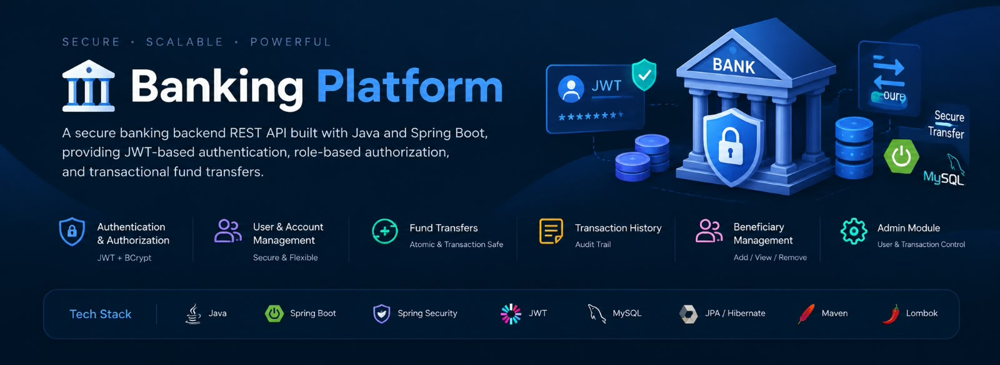

🏦 Banking Platform

A secure banking backend REST API built with Java and Spring Boot, providing JWT-based authentication, role-based authorization, account management, beneficiary management, and secure transactional fund transfers.

---

🚀 Features

🔐 Authentication & Authorization

- User registration and login
- BCrypt password hashing for secure password storage
- Stateless authentication using JWT
- Role-based access control with "USER" and "ADMIN" roles
- Protected API endpoints using Spring Security
- Authentication and authorization validation for secured resources

💳 Account Management

- Create and manage bank accounts
- Automatic unique account number generation
- View account details and current balance
- Account activation and deactivation
- Ownership-based access control
- Users can access only their own accounts

💸 Fund Transfers

- Transfer funds securely between accounts
- Validate sufficient account balance before transfer
- Atomic money transfers using "@Transactional"
- Prevent invalid or unauthorized transfers
- Use "BigDecimal" for accurate monetary calculations
- Maintain transaction records for completed transfers

📜 Transaction Management

- Store complete transaction details
- View transaction history
- Ownership-based access to transaction records
- Maintain transaction status and transfer information
- Audit trail for banking transactions

👤 Beneficiary Management

- Add beneficiaries to a user account
- View registered beneficiaries
- Remove beneficiaries
- Associate beneficiaries with the respective user

👨‍💼 Admin Module

- Admin-only protected endpoints
- View registered users
- Manage user account status
- Activate or deactivate user accounts
- View transactions across the banking platform
- Role-based restriction for administrative operations

---

🛠️ Tech Stack

Technology| Purpose
Java| Core programming language
Spring Boot| Backend framework
Spring Security| Authentication & authorization
JWT (JJWT)| Stateless authentication
BCrypt| Password hashing
Spring Data JPA| Database interaction
Hibernate| ORM
MySQL| Relational database
Maven| Dependency management & build
Lombok| Boilerplate code reduction

---

🏗️ Architecture

The project follows a layered architecture to maintain separation of concerns and make the application easier to maintain and extend.

Client
   ↓
Controller
   ↓
Service
   ↓
Repository
   ↓
MySQL Database

Project Layers

- Controller
  
  - Handles HTTP requests and responses
  - Defines REST API endpoints

- Service
  
  - Contains business logic
  - Performs validation and ownership checks
  - Handles banking operations and transactions

- Repository
  
  - Provides database access through Spring Data JPA
  - Handles CRUD operations for entities

- Model / Entity
  
  - Contains JPA entities
  - Represents database tables and relationships

- DTO
  
  - Defines request and response objects
  - Prevents direct exposure of entity objects through APIs

- Security / Auth
  
  - Handles JWT authentication
  - Configures Spring Security
  - Manages authentication and authorization

- Exception
  
  - Contains custom exceptions
  - Provides centralized exception handling through "GlobalExceptionHandler"

---

🔑 Security

The application uses multiple security mechanisms:

- Spring Security for request-level security
- JWT for stateless authentication
- BCrypt for password hashing
- Role-based authorization for "USER" and "ADMIN"
- Ownership checks to prevent users from accessing other users' accounts
- Protected admin endpoints
- Environment variables for sensitive configuration

---

💰 Transaction Safety

Fund transfers are implemented with Spring's transaction management:

Sender Account
      ↓
Balance Validation
      ↓
Debit Amount
      ↓
Credit Amount
      ↓
Save Transaction
      ↓
Transaction Commit

If any operation fails during the transfer, the database transaction is rolled back to maintain data consistency.

"BigDecimal" is used instead of floating-point types for monetary calculations to avoid precision issues.

---

📂 Project Structure

src/
└── main/
    └── java/
        └── org/
            └── satyam/
                └── banking_platform/
                    ├── Config/
                    ├── Controller/
                    ├── DTO/
                    ├── Exception/
                    ├── Model/
                    ├── Repository/
                    ├── Service/
                    └── BankingPlatformApplication.java

---

🌐 API Overview

Module| Base Path| Access
Authentication| "/auth"| Public
Accounts| "/accounts"| Authenticated Users
Transactions| "/transactions"| Authenticated Users
Beneficiaries| "/api/beneficiaries"| Authenticated Users
Admin| "/admin"| Admin Only

---

⚙️ Getting Started

Prerequisites

Make sure the following are installed:

- Java 21+
- Maven
- MySQL
- Git

1. Clone the Repository

git clone https://github.com/<satyam24012006>/Banking_Platform.git
cd Banking_Platform

2. Configure MySQL

Create a MySQL database or allow the application to create it automatically through the configured JDBC URL.

3. Configure Environment Variables

The application uses environment variables for sensitive configuration.

Variable| Description
"DB_PASSWORD"| MySQL database password
"JWT_SECRET"| Base64-encoded secret used for JWT signing

Do not commit passwords, JWT secrets, or other sensitive credentials to GitHub.

4. Run the Application

Using Maven Wrapper:

./mvnw spring-boot:run

On Windows:

mvnw.cmd spring-boot:run

The application will start at:

http://localhost:8080

---

📡 API Usage

The APIs can be tested using tools such as:

- Postman
- IntelliJ HTTP Client

Typical authentication flow:

Register User
     ↓
Login
     ↓
Receive JWT
     ↓
Send JWT in Authorization Header
     ↓
Access Protected APIs

Example:

Authorization: Bearer <JWT_TOKEN>

---

🔄 Transaction Flow

A typical fund transfer follows this process:

Authenticated User
       ↓
Transfer Request
       ↓
Validate Sender
       ↓
Validate Receiver
       ↓
Check Account Ownership
       ↓
Check Sufficient Balance
       ↓
Debit Sender
       ↓
Credit Receiver
       ↓
Create Transaction Record
       ↓
Commit Transaction

---

📌 Known Limitations

- Automated test coverage is not implemented yet.
- Some transaction history filtering is currently handled in-memory.
- Ownership validation can be further strengthened for certain user and beneficiary operations.

---

🔮 Future Improvements

Potential future enhancements include:

- Two-factor authentication (2FA)
- Redis-based account balance caching
- Monthly account statements
- Advanced transaction auditing
- Fraud detection mechanisms
- Payment gateway integration/simulation
- AES-based data-at-rest encryption
- Improved automated test coverage

⭐ Project Highlights

This project demonstrates practical implementation of:

- RESTful API development
- Spring Boot backend architecture
- Spring Security
- JWT authentication
- Role-based authorization
- Database relationships using JPA/Hibernate
- Transaction management with ACID principles
- Secure money transfer logic
- Exception handling
- DTO-based API design
- Layered backend architecture
